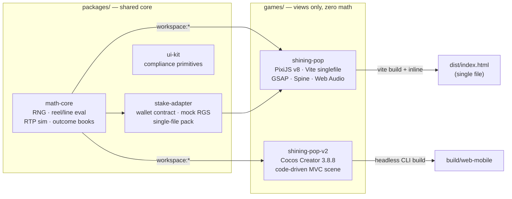
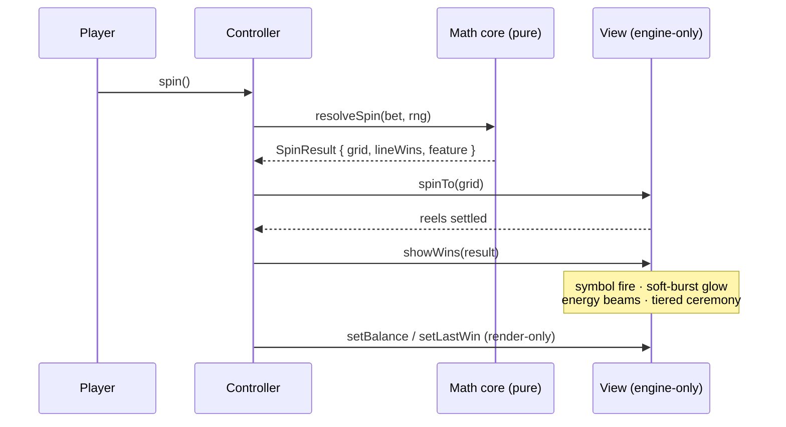

<div align="center">


# Shining Pop — Multi-Engine Slot Studio

**by Edgar Hovsepyan** · one engineer, two engines, one provably-correct math core

[](games/shining-pop)
[](games/shining-pop-v2)
[](#engineering-standards)
[](#quality-gates)
[](#the-math-is-owned-end-to-end)

*Two production slot games sharing one deterministic math core — each shippable
as a self-contained casino-RGS build, designed, built and verified end-to-end
by a single developer.*

</div>

---

## The games

| Game | Engine | Stack | RTP | Status |
| --- | --- | --- | --- | --- |
| **[shining-pop](games/shining-pop)** | PixiJS v8 | Vite · GSAP · Spine · Web Audio | ~97 % | flagship — submission-ready |
| **[shining-pop-v2](games/shining-pop-v2)** | Cocos Creator 3.8.8 | code-driven MVC scene · CCEffect shaders | ~97.5 % | parity port + shader VFX suite |

## Screens

<div align="center">

### Cocos Creator 3.8.8 — `shining-pop-v2`


*Candy reskin · per-symbol shader fire on wins · soft-burst god-ray glow · win-line energy beams*


<table>
  <tr>
    <td align="center" valign="top">
      <br/>
      <em>Portrait: safe-area deck, clamped BUY&nbsp;BONUS, 44&nbsp;px targets</em>
    </td>
    <td align="center" valign="top">
      <br/>
      <br/>
      <em>PixiJS v8 flagship: branded intro gate &amp; full control surface</em>
    </td>
  </tr>
</table>

</div>

## Instant run — no toolchain needed

Both playable builds ship in the repo:

```bash
npx serve games/shining-pop/dist -l 5180            # PixiJS  → http://localhost:5180
npx serve games/shining-pop-v2/build/web-mobile -l 8200   # Cocos → http://localhost:8200
```

## Architecture



**One math core, two render targets** — a payout rule or RTP tune happens once
and both games inherit it; a cross-engine drift test enforces it. The rule that
keeps every game correct: **math decides, the game renders.** Money is never
recomputed in a view.

Every spin follows the same contract in both engines:



## What is actually in these games

- **Math, owned end-to-end** — seeded mulberry32 RNG, reel-strip builder, line
  evaluator, WILD STRIKE feature, three buy-bonus modes with sim-anchored
  costs, a Monte-Carlo simulator (2M+ spins per run), outcome-book generator,
  and a `node:test` suite that pins engine results against the shared core so
  the two games can never drift.
- **A real-time shader VFX suite (Cocos)** — nine custom CCEffect programs
  written for WebGL2 with a graceful ES100 variant: per-symbol **fire clipped
  to each symbol's own alpha silhouette**, rim-light + specular-sweep winner
  highlight, **soft-burst** god-ray glow (continuous falloff — banding-free by
  construction), **win-line energy beams** (flowing fbm plasma ribbons), reel
  portal warp, buy-button plasma, payline bloom. Every shader honors a master
  switch and reduced-motion, with vector-graphics fallbacks.
- **Full control surface** — web bar (account panel, LAST WIN / TOTAL BET
  banners, swipeable bet carousel, ×2 gamble, quick-bet chip stack, turbo,
  autoplay, ringed spin with a 4-state hover/press glow machine) and a
  portrait mobile bar with safe-area handling — picked per orientation,
  rebuilt on rotation.
- **Player systems** — autoplay with stop-on-feature / stop-on-big-win and a
  jurisdiction-cap hook; tri-state turbo; quick-bet ladder; settings (sound,
  speed, reduced effects); game info with rules / data-derived paytable / RTP;
  animated menu hub.
- **Presentation** — branded boot loader, tap-to-play intro with audio unlock,
  win ceremonies whose intensity scales continuously with the win multiple,
  kinetic count-ups, wild-landing strikes, sticky-lock confirmations,
  anticipation reels, ember particles, screen-shake choreography.
- **Audio as a system** — a 37-clip generated bank through a 4-bus dB mix,
  base↔bonus music crossfades, looped reel-rush bed, first-gesture unlock, a
  procedural synth fallback — plus the LDW rule (no triumphant feedback on
  returns ≤ 1× bet).
- **Compliance engineering** — labeled 2-decimal money everywhere, designed
  bet ladder, controls locked during spins/autoplay, reduced-motion mode,
  keyboard map, silent production console, responsive from desktop to 400×225.

## Developer quick start

```bash
pnpm install
pnpm -r build                                  # shared packages
pnpm test                                      # node:test suites (45 green)
pnpm sim                                       # Monte-Carlo RTP of the math core

pnpm --filter @artest/shining-pop dev          # PixiJS dev server :5173
pnpm --filter @artest/shining-pop-v2 test      # Cocos pure-logic tests
pnpm --filter @artest/shining-pop-v2 sim       # Cocos RTP sim (2M spins)
```

Cocos rebuilds headlessly (no editor session needed):

```bash
CocosCreator --project games/shining-pop-v2 --build "platform=web-mobile;debug=false"
```

## Quality gates

1. **Math gate** — RTP in band; book == simulator == engine (three-way cross-check)
2. **Approval floor** — 100 frontend cases: responsive presets without scroll, silent console, replay, resume
3. **Award ceiling** — 100 visual-FX/gamification elements + WCAG 2.2 (flash, motion, contrast, keyboard)
4. **Brand gate** — shipped artifacts carry **only** ARTEST | BrainRocket branding; zero external resources

## Engineering standards

Conventional Commits enforced by commitlint + husky · shared ESLint flat
config + Prettier · strict TypeScript (`no-explicit-any`) · zero allocation in
per-frame loops · pure logic with no engine imports · data-driven view configs
(designers tune data, never component code).

---

<div align="center">

© Edgar Hovsepyan — **ARTEST | BrainRocket**. All rights reserved.

</div>
