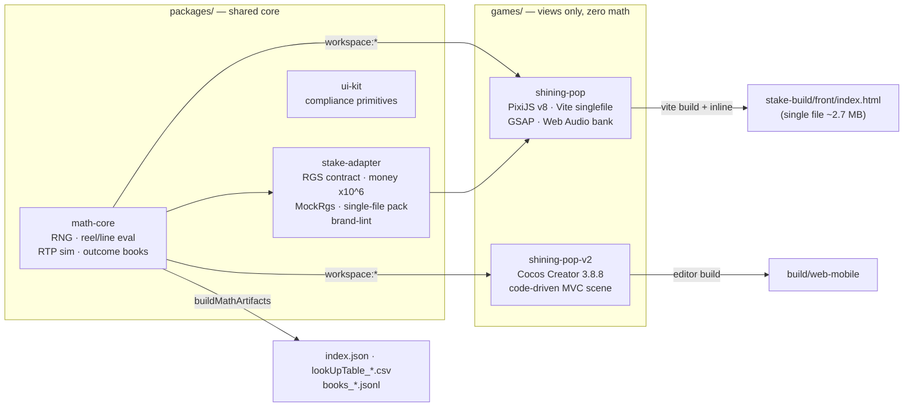

# ARTEST | BrainRocket — Slot Games Studio

**by Edgar Hovsepyan**

A multi-engine monorepo of production slot games. Shared, provably-correct slot
math feeds two sibling flagships — **Shining Pop** (PixiJS v8) and **Shining Pop V2**
(Cocos Creator 3.8.8) — each shippable as a self-contained casino-RGS build with
its own outcome-book math.

## Portfolio

| Game               | Engine              | RTP     | Features                                           | Status                          |
| ------------------ | ------------------- | ------- | -------------------------------------------------- | ------------------------------- |
| **shining-pop**    | PixiJS v8 + GSAP    | ~96.5 % | scatter free-spins (3 modes) + buy bonus + i18n    | single-file, verified, ★★ ready |
| **shining-pop-v2** | Cocos Creator 3.8.8 | ~97.5 % | WILD STRIKE + STICKY WILDS + 3 buy free-spin modes | view polish to flagship level   |

> Target: every release ships at ~96% RTP, single-file, approval-gated.

## Architecture



The rule that keeps every game correct: **`math-core` decides outcomes; the game
only renders them.** The same pure code runs the game, the RTP simulator, and the
shipped math — so correctness is provable offline. Money is never recomputed in a
view; the frontend renders exactly what the round supplies.

Both games share one visual identity (the Shining Pop brand family) and one MVC
discipline: pure `logic/` with no engine imports (unit-tested with node:test),
state in `model/`, engine-only `view/`, one controller as composition root.

## Stack

- **Math**: TypeScript strict, mulberry32 seeded RNG, Monte-Carlo simulation (2M+ spins), Stake-style outcome books
- **PixiJS flagship**: pixi.js 8.18.1, GSAP 3.12, Vite 5 + vite-plugin-singlefile, procedural + sampled Web Audio (37-clip bank)
- **Cocos flagship**: Cocos Creator 3.8.8, code-driven scene (single `SlotController` on Canvas), Tween-based reel engine
- **Quality**: ESLint flat config, Prettier, commitlint (+ `math`/`vfx`/`audio`/`ux` types), husky + lint-staged, GitHub Actions CI

## Quick start

```bash
pnpm install
pnpm -r build          # build shared packages
pnpm test              # unit tests across packages + games (node:test)
pnpm sim               # Monte-Carlo RTP of the math-core fixture
pnpm lint              # ESLint (flat config)
```

Per game:

```bash
pnpm --filter @artest/shining-pop dev          # PixiJS dev server :5173
pnpm --filter @artest/shining-pop build:stake  # single-file Stake build
pnpm --filter @artest/shining-pop-v2 test      # Cocos pure-logic tests
pnpm --filter @artest/shining-pop-v2 sim       # Cocos RTP sim (2M spins)
```

Shining Pop V2 visuals run in the Cocos Creator 3.8.8 editor (project root
`games/shining-pop-v2`). See [docs/ADDING-A-GAME.md](docs/ADDING-A-GAME.md).

## Quality gates

Every submission passes, in order:

1. **Math gate** — RTP in band (90–98%), book RTP == simulator RTP == engine RTP (three-way cross-check)
2. **Approval floor** — `stake-approval-visual-gate`: 100 frontend cases (P0 blockers → P1 suppressors → P2 polish), 7 responsive presets without scroll, silent console, Bet Replay, stateless resume
3. **Award ceiling** — `cocos-aaa-visual-gate`: 100 visual-FX/gamification elements + WCAG 2.2 (flash, motion, contrast, keyboard)
4. **Brand gate** — `artest-brand-lint`: shipped artifacts carry **only** ARTEST | BrainRocket branding; `artest-check-singlefile`: zero external resources

## Engineering standards

Conventional Commits (commitlint + husky), shared ESLint/Prettier, strict
TypeScript (`no-explicit-any`), zero allocation inside per-frame loops, the
casino-RGS compliance checklist ([docs/STAKE-CHECKLIST.md](docs/STAKE-CHECKLIST.md)).

© Edgar Hovsepyan — ARTEST | BrainRocket. All rights reserved.
