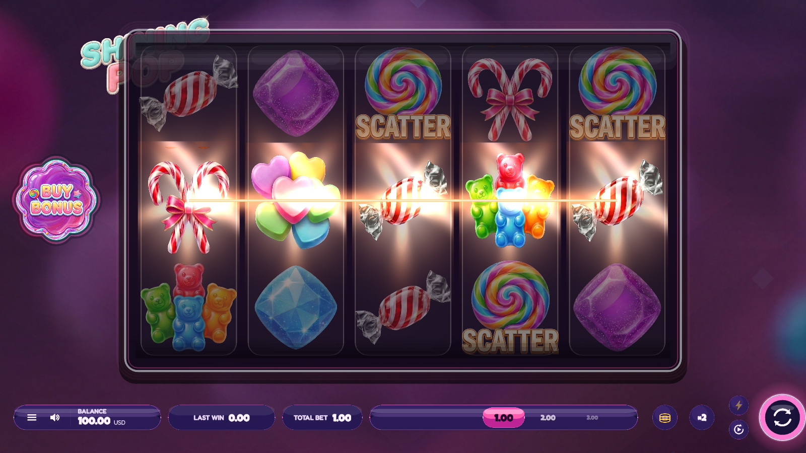
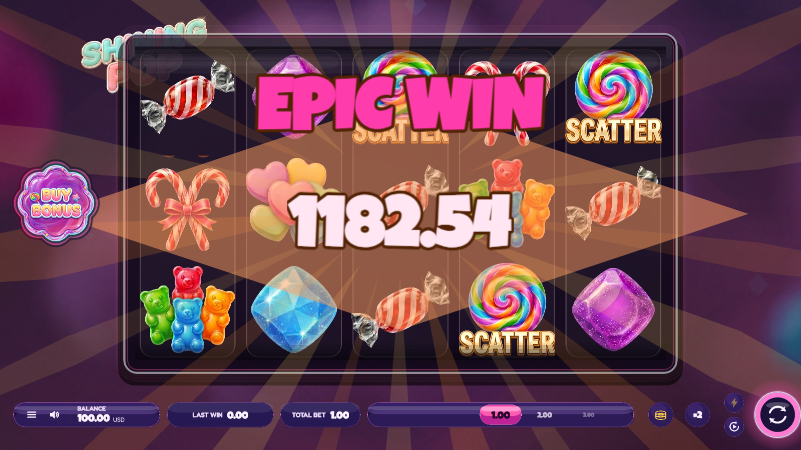
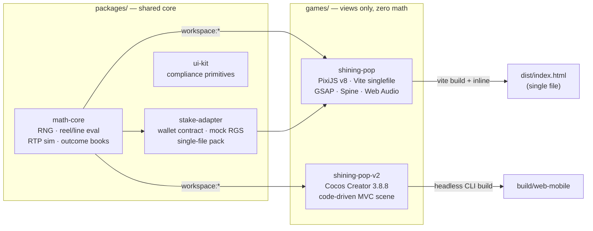
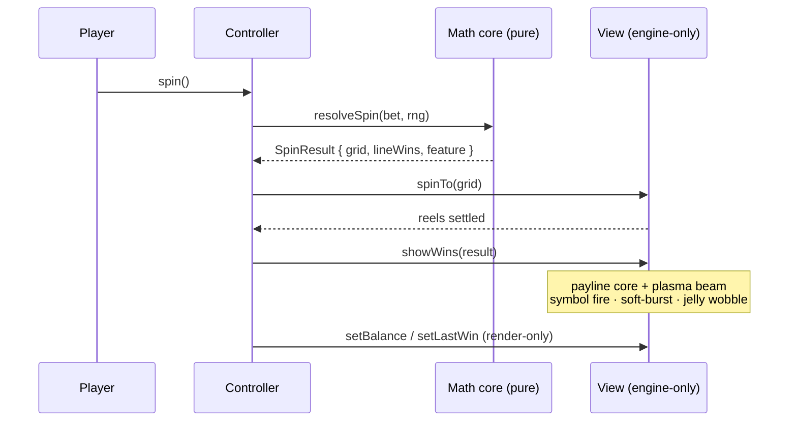

<div align="center">


# Shining Pop — Multi-Engine Slot Studio

**by Edgar Hovsepyan** · one engineer, two engines, one provably-correct math core

[](games/shining-pop)
[](games/shining-pop-v2)
[](#engineering-standards)
[](#quality-gates)
[](#developer-quick-start)

_Two production slot games on one deterministic, sim-anchored math core —
designed, built and verified end-to-end by a single developer._

</div>

---

## The games

| Game                                       | Engine              | Stack                                | RTP     | Status                         |
| ------------------------------------------ | ------------------- | ------------------------------------ | ------- | ------------------------------ |
| **[shining-pop](games/shining-pop)**       | PixiJS v8           | Vite · GSAP · Spine · Web Audio      | ~97 %   | flagship — submission-ready    |
| **[shining-pop-v2](games/shining-pop-v2)** | Cocos Creator 3.8.8 | code-driven MVC · 9 CCEffect shaders | ~97.5 % | parity port + shader VFX suite |

## ▶ Live demo

Both games are deployed from one static bundle behind a landing page — reviewers
can play either without cloning or installing anything:

|                                    | Play                                                  |
| ---------------------------------- | ----------------------------------------------------- |
| **Landing** (both games)           | `https://<your-vercel-app>.vercel.app/`               |
| **shining-pop** · PixiJS v8        | `https://<your-vercel-app>.vercel.app/shining-pop`    |
| **shining-pop-v2** · Cocos Creator | `https://<your-vercel-app>.vercel.app/shining-pop-v2` |

> Replace `<your-vercel-app>` with the deployed URL. **Deploy in one step** — the
> repo is Vercel-ready (`vercel.json` + `scripts/assemble-demo.mjs`):
>
> ```bash
> npx vercel --prod          # or: import the GitHub repo at vercel.com/new
> ```
>
> Vercel runs `assemble-demo.mjs`, which copies the two committed builds into
> `/public` at clean paths (`/shining-pop`, `/shining-pop-v2`) behind an
> expert landing page. Each game keeps its own directory root so its assets
> resolve — verified booting at both subpaths. Works the same on Netlify /
> GitHub Pages (point the host at the `public/` the script produces).

## Instant run — no toolchain needed

Both playable builds ship in the repo. With Node ≥ 20 installed, run from the repo root:

```bash
node scripts/preview.mjs
#  ▶ PixiJS  — shining-pop     http://localhost:5180
#  ▶ Cocos   — shining-pop-v2  http://localhost:8200
```

No install step, no dependencies — open either URL and play.
(`npx serve games/shining-pop/dist -l 5180` works too if you prefer.)

## Screens

<div align="center">


_Cocos Creator 3.8.8 — candy reskin, authored icon set, full-bleed reels_



_Win presentation: gold payline core + flowing plasma beam · per-symbol shader fire · jelly squash-and-stretch · win-focus dim_



_Spine 4.2 win-callout: winged golden-heart banner, cotton-candy cloud, floating petals, kinetic gold count-up — tier-scaled, with a procedural fallback_

<table>
  <tr>
    <td align="center" valign="top">
      <br/>
      <em>Portrait: safe-area deck, docked BUY BONUS,<br/>44 px targets</em>
    </td>
    <td align="center" valign="top">
      <br/>
      <br/>
      <em>PixiJS v8 flagship — branded intro gate &amp; full control surface</em>
    </td>
  </tr>
</table>

</div>

## Architecture



**One math core, two render targets** — a payout rule or RTP tune happens once and
both games inherit it; a cross-engine drift test enforces it. The rule that keeps
every game correct: **math decides, the game renders.** Money is never recomputed
in a view.



## Feature highlights

- **Math owned end-to-end** — seeded RNG, reel-strip builder, line evaluator,
  WILD STRIKE, three buy-bonus modes with sim-anchored costs, a 2M-spin
  Monte-Carlo simulator, outcome-book generator, and a cross-engine drift suite.
- **A real shader VFX suite (Cocos)** — nine custom CCEffect programs (WebGL2 +
  ES100 variants): per-symbol fire clipped to each symbol's alpha silhouette,
  rim-light + specular sweep, banding-free soft-burst glow with rotating rays,
  flowing payline plasma with a traveling pulse, reel portal warp, buy-button
  plasma. Every shader honors a master switch, reduced-motion, and a vector
  fallback.
- **Modern win language** — winners jelly-wobble while non-winners dim back;
  a crisp 3 px gold payline core rides a soft plasma bloom; a tier-scaled Spine
  win-callout (winged-heart banner + cotton-candy cloud) crowns the big wins,
  with a procedural light-rig fallback if the skeleton is unavailable.
- **Full control surface** — authored icon set across both bars, swipeable bet
  carousel, ×2 gamble, quick-bet stack, turbo, autoplay with stop conditions,
  4-state buttons with hover/press glow, animated panel transitions, and a
  buy-bonus modal with per-tier affordability (`NEED <cost>` refusal states).
- **Compliance engineering** — labeled 2-decimal money everywhere, RGS-style
  bet ladder, controls locked during spins, reduced-motion mode, keyboard map,
  silent production console, responsive from desktop to 390×844 portrait.

## Developer quick start

```bash
corepack enable                                # one-time: gets the pinned pnpm
pnpm install
pnpm test                                      # builds packages + runs all suites (73 green)
pnpm sim                                       # Monte-Carlo RTP of the math core (2M spins)
pnpm preview                                   # serve both shipped game builds

pnpm --filter @artest/shining-pop dev          # PixiJS dev server :5173
pnpm --filter @artest/shining-pop-v2 sim       # Cocos RTP sim (2M spins)
```

Cocos rebuilds headlessly — no editor session needed:

```bash
CocosCreator --project games/shining-pop-v2 --build "platform=web-mobile;debug=false"
```

## Quality gates

1. **Math gate** — RTP in band; book == simulator == engine (three-way cross-check)
2. **Approval floor** — 100 frontend cases: responsive presets without scroll, silent console, replay, resume
3. **Award ceiling** — 100 visual-FX/gamification elements + WCAG 2.2 (flash, motion, contrast, keyboard)
4. **Brand gate** — shipped artifacts carry **only** ARTEST | BrainRocket branding; zero external resources

## Engineering standards

Conventional Commits enforced by commitlint + husky · shared ESLint flat config +
Prettier · strict TypeScript (`no-explicit-any`) · zero allocation in per-frame
loops · pure logic with no engine imports · data-driven view configs (designers
tune data, never component code).

---

<div align="center">

© Edgar Hovsepyan — **ARTEST | BrainRocket**. All rights reserved.

</div>
