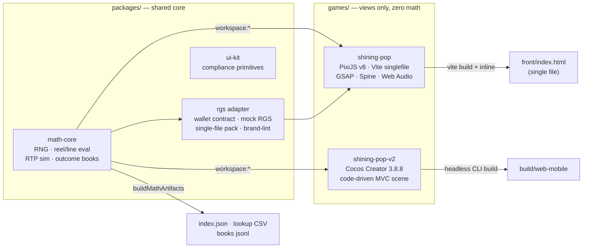

# ARTEST | BrainRocket — Slot Game Task


**by Edgar Hovsepyan** — one engineer, two engines, one provably-correct math core.

A multi-engine monorepo of production slot games. Shared, deterministic slot
math feeds two sibling flagships — **Shining Pop** (PixiJS v8) and **Shining Pop V2**
(Cocos Creator 3.8.8) — each shippable as a self-contained casino-RGS build with
its own outcome-book math, built end-to-end by a single developer.

## Portfolio

| Game               | Engine              | RTP     | Status                      |
| ------------------ | ------------------- | ------- | --------------------------- |
| **shining-pop**    | PixiJS v8 + GSAP    | ~97 %   | flagship — submission-ready |
| **shining-pop-v2** | Cocos Creator 3.8.8 | ~97.5 % | parity port of the flagship |

## What is actually in these games


Far beyond a base-spin brief — every system below was designed, built and
verified in-repo:

- **Math, owned end-to-end**: seeded mulberry32 RNG, reel-strip builder, line
  evaluator, WILD STRIKE feature, three buy-bonus modes with sim-anchored
  costs, Monte-Carlo simulator (2M+ spins per run), outcome-book generator,
  and a node:test suite that pins engine results against the shared core so
  the two games can never drift.
- **Full control surface**: web bar (account panel, LAST WIN / TOTAL BET
  banners, swipeable bet carousel, ×2 gamble, quick-bet chip stack, turbo,
  autoplay, ringed spin) and a portrait mobile bar — the game picks per
  orientation and rebuilds on rotation.
- **Player systems**: autoplay with stop-on-feature / stop-on-big-win and
  jurisdiction-cap hook; tri-state turbo driving reel scalars and autoplay
  pacing; quick-bet ladder; settings (sound, speed, reduced effects); game
  info with rules / data-derived paytable / RTP page; menu hub.
- **Presentation**: branded boot loader, tap-to-play intro with audio unlock,
  god-ray win ceremonies whose violence scales continuously with the win
  multiple, kinetic count-ups with landing pops, wild-landing strikes,
  sticky-lock confirmations, anticipation reels, particle bursts, win-line
  cycling, Spine-rigged ceremony crown (PixiJS), screen-shake choreography.
- **Audio as a system**: a 37-clip generated bank played through a 4-bus dB
  mix (music / gameplay / sfx / win), music crossfades between base and
  bonus, looped reel-rush bed, first-gesture unlock, and a procedural synth
  fallback so the game is never silent — plus the LDW rule (no triumphant
  feedback on returns ≤ 1× bet).
- **Compliance engineering**: labeled 2-decimal money everywhere, designed
  bet ladder, controls locked during spins/autoplay, reduced-motion mode,
  full keyboard map, silent production console, responsive presets from
  desktop down to 400×225 popouts.

## How we work (the studio workflow)

1. **Research** — competitive teardown of top-provider feel (reel timings,
   ceremony pacing, bar anatomy), platform approval cases, and engine
   constraints; findings land in `docs/` and drive everything after.
2. **PRD & math first** — the game is specified as data (paytable, lines,
   weights, feature rules), the math core is written pure + unit-tested, and
   RTP is anchored by simulation before a single pixel exists.
3. **Generation pass** — assets (symbols, logo, world, 37 audio masters)
   produced and post-processed in-pipeline (black-key extraction, compression,
   atlas discipline).
4. **Build with the architecture** — engine-agnostic `logic/` + `model/`,
   engine-only `view/`, one controller as composition root; the same MVC in
   both engines so a feature ports file-for-file.
5. **VFX & motion** — GSAP timelines, Spine rigs and gradient-mesh light work
   on PixiJS; vector-graphics light systems on Cocos (no fragile runtime
   shaders in a compliance context); every effect honors reduced-motion.
6. **Tooling as leverage** — local AI agents drive headless engine builds,
   in-browser QA loops (boot, spin, screenshot, console-silence checks) and
   an editor MCP plugin for scene work, which is how one person ships at
   studio cadence.
7. **Gate before ship** — math gate (book == simulator == engine), the
   100-case frontend approval floor, the award-tier visual ceiling, and the
   brand gate (only ARTEST | BrainRocket ships).

Full parity ledger between the two games: [docs/COCOS-PARITY-PLAN.md](docs/COCOS-PARITY-PLAN.md).

## Architecture



**Why a monorepo**: one math core, two render targets — fixing a payout rule
or tuning RTP happens once and both games inherit it, with a cross-engine
drift test enforcing it. **Why MCP + agents**: the Cocos editor and the
browser are driven programmatically, so build → boot → screenshot → fix runs
as a loop instead of a manual ritual.

The rule that keeps every game correct: **math decides, the game renders.**
Money is never recomputed in a view.

## Quick start

```bash
pnpm install
pnpm -r build          # build shared packages
pnpm test              # unit tests across packages + games (node:test)
pnpm sim               # Monte-Carlo RTP of the math core
pnpm lint              # ESLint (flat config)
```

Per game:

```bash
pnpm --filter @artest/shining-pop dev          # PixiJS dev server :5173
pnpm --filter @artest/shining-pop build:stake  # single-file platform build
pnpm --filter @artest/shining-pop-v2 test      # Cocos pure-logic tests
pnpm --filter @artest/shining-pop-v2 sim       # Cocos RTP sim (2M spins)
```

Cocos builds headlessly (no editor needed):

```bash
CocosCreator --project games/shining-pop-v2 --build "platform=web-mobile;debug=false"
npx serve games/shining-pop-v2/build/web-mobile -l 7457
```

## Quality gates

1. **Math gate** — RTP in band, book == simulator == engine (three-way cross-check)
2. **Approval floor** — 100 frontend cases, responsive presets without scroll, silent console, replay, resume
3. **Award ceiling** — 100 visual-FX/gamification elements + WCAG 2.2 (flash, motion, contrast, keyboard)
4. **Brand gate** — shipped artifacts carry **only** ARTEST | BrainRocket branding; zero external resources

## Engineering standards

Conventional Commits (commitlint + husky), shared ESLint/Prettier, strict
TypeScript (`no-explicit-any`), zero allocation inside per-frame loops, pure
logic with no engine imports, data-driven view configs (designers tune data,
never component code).

© Edgar Hovsepyan — ARTEST | BrainRocket. All rights reserved.
