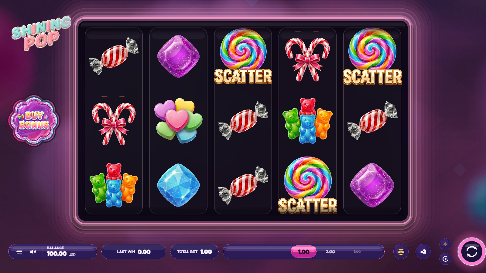
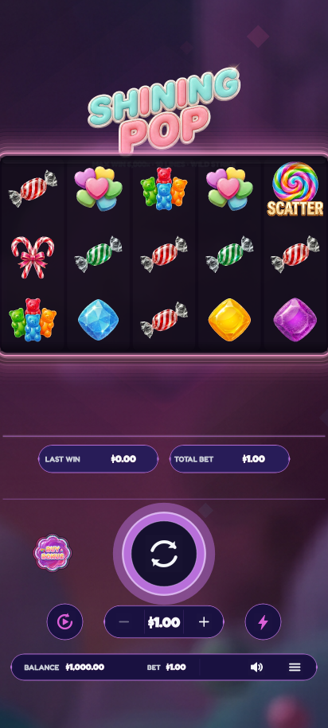
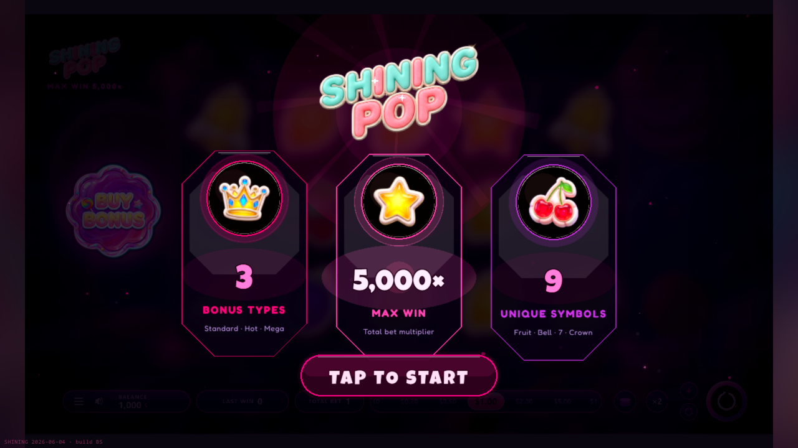
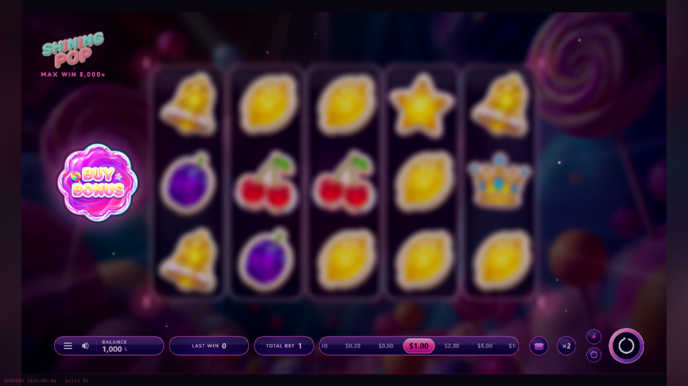
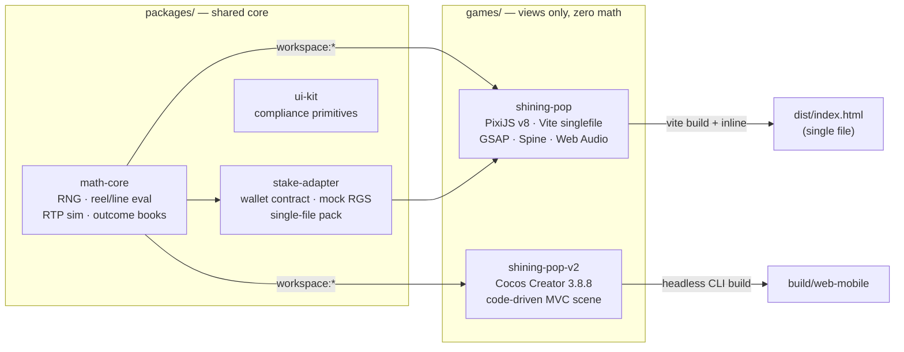
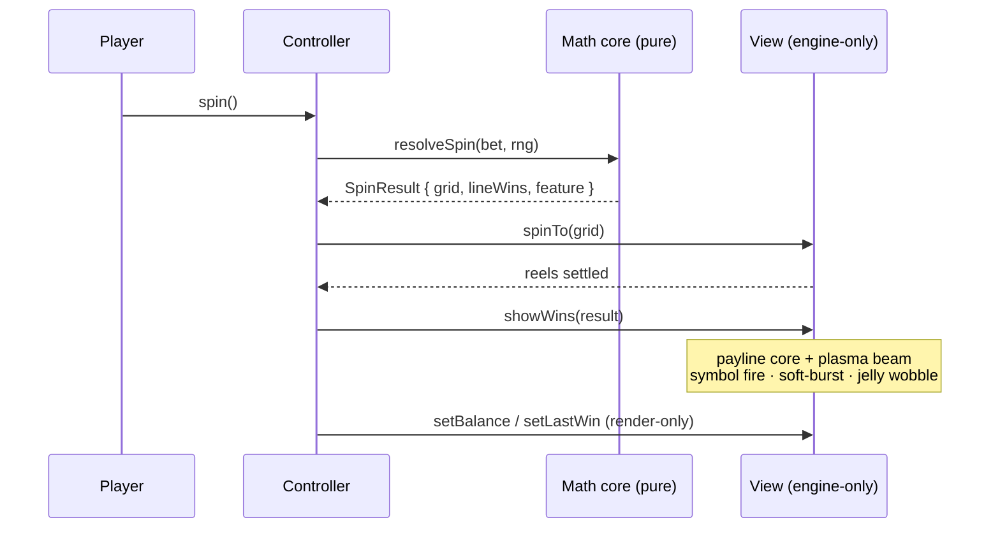

<div align="center">


# Shining Pop — Multi-Engine Slot Studio

**by Edgar Hovsepyan** · one engineer, two engines, one provably-correct math core

[](games/shining-pop)
[](games/shining-pop-v2)
[](#engineering-standards)
[](#quality-gates)
[](#developer-quick-start)
[](#quality-gates)
[](https://artest-brainrocket-task.vercel.app/)

_Two production slot games on one deterministic, sim-anchored math core —
designed, built and verified end-to-end by a single developer._

</div>

---

## The games

| Game                                       | Engine              | Stack                                 | RTP     | Status                         |
| ------------------------------------------ | ------------------- | ------------------------------------- | ------- | ------------------------------ |
| **[shining-pop](games/shining-pop)**       | PixiJS v8           | Vite · GSAP · Spine · Web Audio       | ~97.8 % | flagship — submission-ready    |
| **[shining-pop-v2](games/shining-pop-v2)** | Cocos Creator 3.8.8 | code-driven MVC · 11 CCEffect shaders | ~97.8 % | parity port + shader VFX suite |

> Two games, one candy slot. **No other variations** — the PixiJS flagship and the Cocos parity port share a single deterministic math core.

## ✨ The craft

This is built to an **awards-tier** bar, not a template floor:

- 🍬 **Material, not decoration** — peppermint candy-material win line (GLSL specular gloss), symbol-shaped additive halos clipped to the candy alpha, a 3D card-turn pop on winning symbols lifted above the reel mask. No stroked boxes, no diagonal CSS sheens.
- 🎯 **Readable by design** — win-focus dim, left→right reveal cadence, tap-the-reels to flash every payline, panels that hand the screen cleanly to the player on mobile.
- 📱 **Mobile-first responsiveness** — transparent floating bars, glyphs oversampled to stay crisp at any scale, safe-area decks, capped device-pixel-ratio for crisp-yet-60fps.
- 🔒 **Provably correct** — one sim-anchored math core, 75 passing unit tests, an RTP economy guard in CI, server-authoritative crediting.

## ▶ Live demo

**▶ Live now — play in the browser, no install:**

|                                    | Play                                                           |
| ---------------------------------- | -------------------------------------------------------------- |
| **Landing** (both games)           | **https://artest-brainrocket-task.vercel.app/**                |
| **shining-pop** · PixiJS v8        | **https://artest-brainrocket-task.vercel.app/shining-pop/**    |
| **shining-pop-v2** · Cocos Creator | **https://artest-brainrocket-task.vercel.app/shining-pop-v2/** |

> Deployed on Vercel from one static bundle behind a landing page. The repo is
> deploy-ready (`vercel.json` + `scripts/assemble-demo.mjs`) — to redeploy:
>
> ```bash
> npx vercel --prod          # or: import the GitHub repo at vercel.com/new
> ```
>
> Vercel runs `assemble-demo.mjs`, which copies the two committed builds into
> `/public` at clean paths (`/shining-pop/`, `/shining-pop-v2/`) behind the
> landing page. Each game keeps its own directory root (`trailingSlash: true`) so
> its assets resolve — both verified booting live. Works the same on Netlify /
> GitHub Pages (point the host at the `public/` the script produces).

## Instant run — no toolchain needed

Both playable builds ship in the repo. With Node ≥ 20 installed, run from the repo root:

```bash
node scripts/preview.mjs
#  ▶ PixiJS  — shining-pop     http://localhost:5180
#  ▶ Cocos   — shining-pop-v2  http://localhost:8200
```

No install step, no dependencies — open either URL and play.
(`npx serve games/shining-pop/dist -l 5180` works too if you prefer.)

## Screens

<div align="center">

**Two games, one shared math core** — a Cocos Creator 3.8.8 build and a PixiJS v8 build of the same candy slot. (No other variations.)



_Cocos Creator 3.8.8 — candy reskin, authored icon set, continuous reels in a glass-portal window, peppermint candy-material win line, symbol-shaped halo, win-focus dim_

<table>
  <tr>
    <td align="center" valign="top">
      <br/>
      <em>Cocos portrait: transparent deck, docked<br/>BUY BONUS, panels hide the bar, 44 px targets</em>
    </td>
    <td align="center" valign="top">
      <br/>
      <br/>
      <em>PixiJS v8 flagship — branded intro gate &amp; full control surface</em>
    </td>
  </tr>
</table>

</div>

## Architecture



**One math core, two render targets** — a payout rule or RTP tune happens once and
both games inherit it; a cross-engine drift test enforces it. The rule that keeps
every game correct: **math decides, the game renders.** Money is never recomputed
in a view.



## Feature highlights

- **Math owned end-to-end** — seeded RNG, reel-strip builder, line evaluator,
  WILD STRIKE, three buy-bonus modes with sim-anchored costs, a 2M-spin
  Monte-Carlo simulator, outcome-book generator, and a cross-engine drift suite.
- **A real shader VFX suite (Cocos)** — eleven custom CCEffect programs (WebGL2 +
  ES100 variants): per-symbol fire clipped to each symbol's alpha silhouette,
  rim-light + specular sweep, banding-free soft-burst glow with rotating rays,
  flowing payline plasma with a traveling pulse, reel portal warp, buy-button
  plasma. Every shader honors a master switch, reduced-motion, and a vector
  fallback.
- **Modern win language** — winners jelly-wobble while non-winners dim back;
  a crisp 3 px gold payline core rides a soft plasma bloom; a tier-scaled Spine
  win-callout (winged-heart banner + cotton-candy cloud) crowns the big wins,
  with a procedural light-rig fallback if the skeleton is unavailable.
- **Full control surface** — authored icon set across both bars, swipeable bet
  carousel, ×2 gamble, quick-bet stack, turbo, autoplay with stop conditions,
  4-state buttons with hover/press glow, animated panel transitions, and a
  buy-bonus modal with per-tier affordability (`NEED <cost>` refusal states).
- **Compliance engineering** — labeled 2-decimal money everywhere, RGS-style
  bet ladder, controls locked during spins, reduced-motion mode, keyboard map,
  silent production console, responsive from desktop to 390×844 portrait.

## Developer quick start

```bash
corepack enable                                # one-time: gets the pinned pnpm
pnpm install
pnpm test                                      # builds packages + runs all suites (75 green)
pnpm sim                                       # Monte-Carlo RTP of the math core (2M spins)
pnpm preview                                   # serve both shipped game builds

pnpm --filter @artest/shining-pop dev          # PixiJS dev server :5173
pnpm --filter @artest/shining-pop-v2 sim       # Cocos RTP sim (2M spins)
```

### Building both games for production

Each game builds to a static bundle that the demo (and any host) serves as-is.

**shining-pop — PixiJS v8 (Vite):** bundles + inlines into a single reviewable `dist/`.

```bash
pnpm --filter @artest/shining-pop build      # → games/shining-pop/dist/
#  or, from the game folder:  cd games/shining-pop && pnpm build
```

**shining-pop-v2 — Cocos Creator 3.8.8:** headless CLI build, no editor session needed.

```bash
CocosCreator --project games/shining-pop-v2 --build "platform=web-mobile;debug=false"
#  Windows path example:
#  "C:/ProgramData/cocos/editors/Creator/3.8.8/CocosCreator.exe" \
#    --project games/shining-pop-v2 --build "platform=web-mobile;debug=false"
#  → games/shining-pop-v2/build/web-mobile/
```

Then `node scripts/assemble-demo.mjs` stitches both builds into `public/` for the
[live demo](#-live-demo), or `node scripts/preview.mjs` serves them locally.

## Quality gates

1. **Math gate** — RTP in band; book == simulator == engine (three-way cross-check)
2. **Approval floor** — 100 frontend cases: responsive presets without scroll, silent console, replay, resume
3. **Award ceiling** — 100 visual-FX/gamification elements + WCAG 2.2 (flash, motion, contrast, keyboard)
4. **Brand gate** — shipped artifacts carry **only** ARTEST | BrainRocket branding; zero external resources

## Engineering standards

Conventional Commits enforced by commitlint + husky · shared ESLint flat config +
Prettier · strict TypeScript (`no-explicit-any`) · zero allocation in per-frame
loops · pure logic with no engine imports · data-driven view configs (designers
tune data, never component code).

---

<div align="center">

© Edgar Hovsepyan — **ARTEST | BrainRocket**. All rights reserved.

</div>
